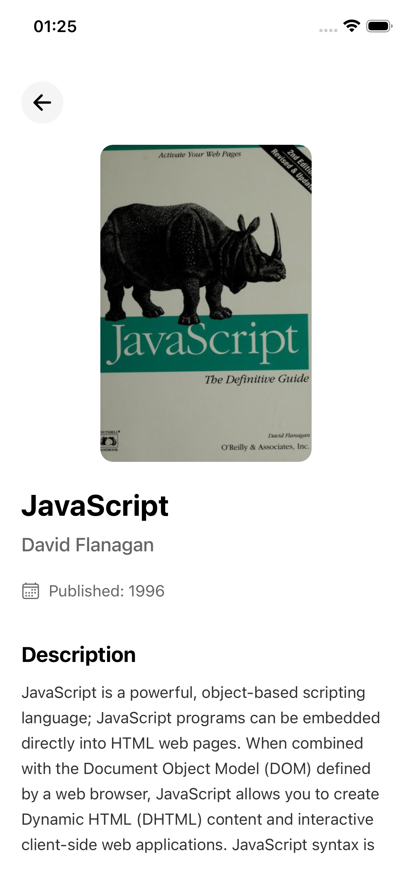
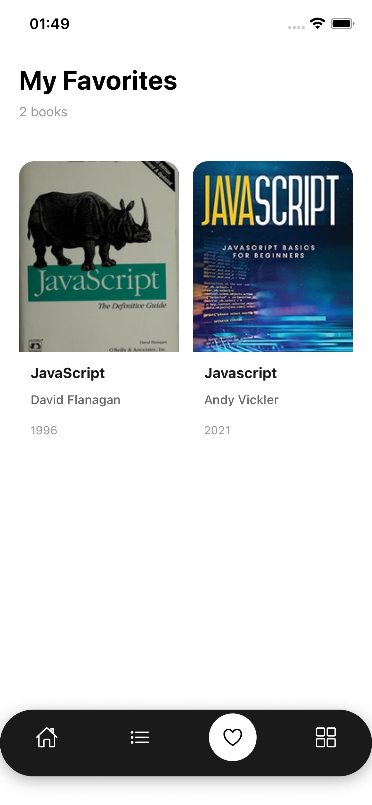
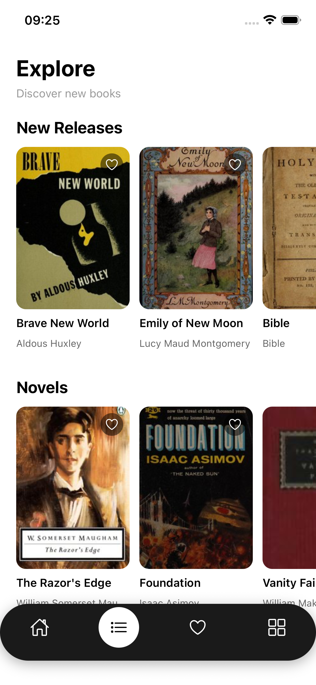

# StudyShelf

StudyShelf is a mobile app designed to help university and school students easily browse, discover, and manage reference books related to their subjects. It acts as a personal digital library companion, allowing students to search for textbooks online, view details, and save their favourite books into a personal reading list.

## Features

- **Authentication** - Secure login and registration with form validation
- **Book Search** - Search for books using Open Library API
- **Book Discovery** - Browse books by categories (Programming, Science, Mathematics, etc.)
- **Book Details** - View full book information including description, publish year, and page count
- **Favorites** - Save and manage favorite books with Redux state management
- **User Profile** - View profile and manage settings
- **Modern UI** - Clean, iOS-style design with bottom tab navigation
- **Responsive Design** - Optimized for mobile devices

## Tech Stack

- **React Native** with Expo
- **TypeScript** for type safety
- **Expo Router** for file-based navigation
- **Redux Toolkit** for global state management
- **Open Library API** for book data
- **Ionicons** for icons

## Screenshots

<table>
  <tr>
    <td></td>
    <td></td>
    <td></td>
  </tr>
  <tr>
    <td align="center">Login Screen</td>
    <td align="center">Register Screen</td>
    <td align="center">Home Screen</td>
  </tr>
  <tr>
    <td></td>
    <td></td>
    <td></td>
  </tr>
  <tr>
    <td align="center">Book Details</td>
    <td align="center">Favorites Page</td>
    <td align="center">Explore Page</td>
  </tr>
</table>
