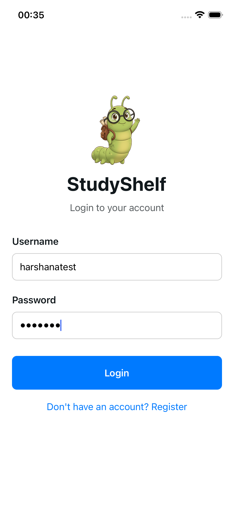
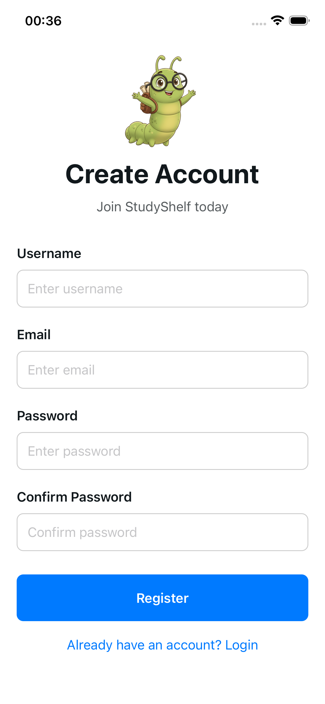
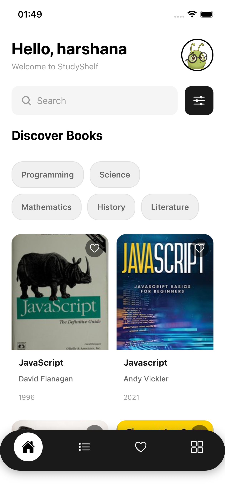

# StudyShelf

StudyShelf is a mobile app designed to help university and school students easily browse, discover, and manage reference books related to their subjects. It acts as a personal digital library companion, allowing students to search for textbooks online, view details, and save their favourite books into a personal reading list.

## Features

- **Authentication** - Secure login and registration
- **Book Search** - Search for books using Open Library API
- **Book Discovery** - Browse computer science and programming books
- **User Profile** - View profile and manage settings
- **Responsive Design** - Clean, modern UI with book cards

## Screenshots

<table>
  <tr>
    <td></td>
    <td></td>
    <td></td>
  </tr>
  <tr>
    <td align="center">Login Screen</td>
    <td align="center">Register Screen</td>
    <td align="center">Home Screen</td>
  </tr>
</table>
